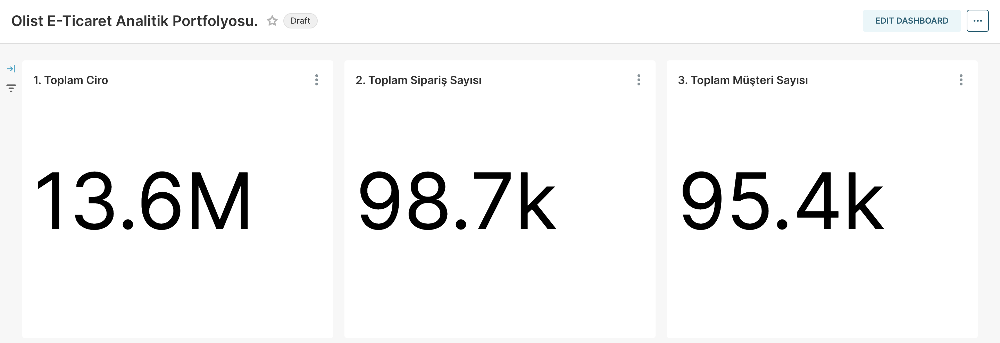
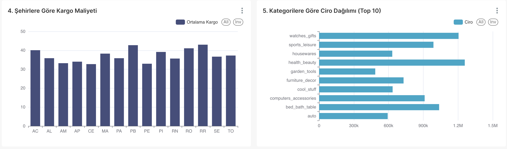
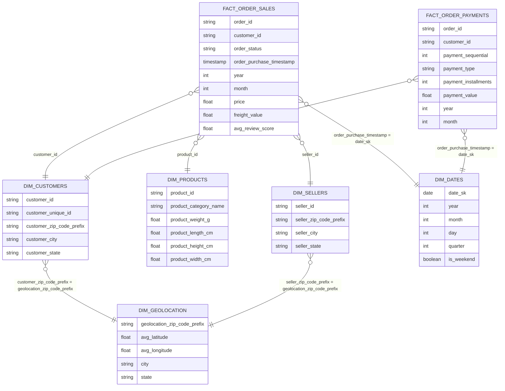
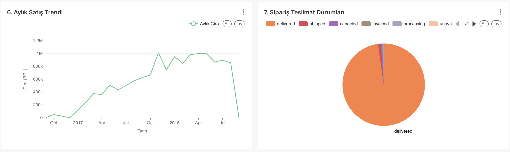
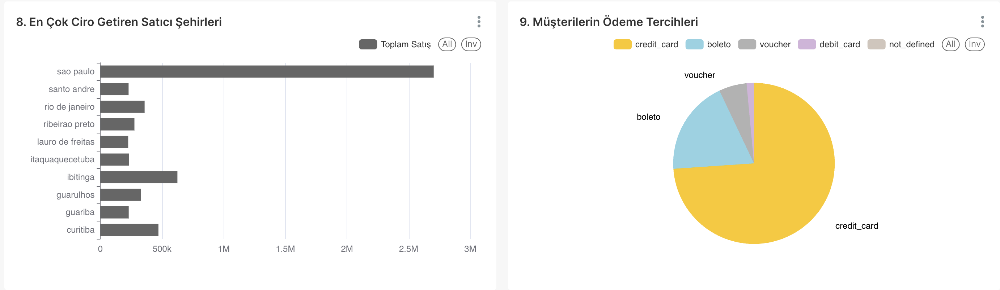
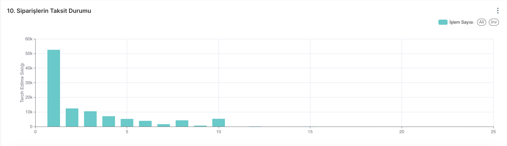

# 🛒 Olist E-Ticaret Veri Mühendisliği ve Analitik Platformu



## 📌 Proje Özeti
Bu proje, Brezilya'nın en büyük e-ticaret platformlarından biri olan **Olist** veri seti kullanılarak sıfırdan inşa edilmiş, uçtan uca (end-to-end) bir **Veri Mühendisliği ve İş Zekası (BI)** platformudur. 

Projenin temel amacı, karmaşık ve dağınık haldeki e-ticaret verilerini alıp, endüstri standartlarındaki **Medallion Mimarisi** (Bronze, Silver, Gold) prensipleriyle işlemek ve şirket yöneticilerinin veri odaklı kararlar almasını sağlayacak hızda bir gösterge paneline (dashboard) dönüştürmektir.

---

## 🏗️ Mimari ve Teknoloji Yığını (Tech Stack)

Modern bir Data Lakehouse mimarisi kurmak için aşağıdaki teknolojiler entegre bir şekilde kullanılmıştır:

- **Orkestrasyon ve Zamanlama:** Apache Airflow
- **Veri İşleme Motoru:** Apache Spark (PySpark)
- **Veri Formatı ve Depolama:** Apache Iceberg + Hadoop (HDFS)
- **İş Zekası ve Görselleştirme:** Apache Superset
- **Konteyner Mimarisi:** Docker & Docker Compose
- **Veri Modelleme:** Kimball Boyutsal Modelleme (Yıldız Şema - Star Schema)



---

## 🛠️ Projede Neler Yaptık? (Adım Adım Geliştirme Süreci)

Bu proje sadece kod yazmaktan ibaret değil, sıfırdan ölçeklenebilir bir veri platformu mimarisi kurma sürecidir. İşte projede gerçekleştirdiğimiz kritik adımlar:

1. **Altyapının Kurulması (Infrastructure):**
   - HDFS, Spark Master/Worker, Airflow, Superset ve gerekli veritabanları için izole Docker konteynerleri oluşturuldu.
   - Bu konteynerlerin birbirleriyle haberleşmesi için ortak bir Docker ağı (`bigdata-net`) kuruldu. (Geliştirme sırasında çıkan port ve network çakışmaları çözülerek sağlam bir yapı kuruldu).

2. **Otomatik Veri Çekme (Ingestion):**
   - Kaggle API'si kullanılarak Olist verisetinin otomatik olarak indirilmesini sağlayan Python betikleri (`download_dataset.py`) yazıldı.

3. **Veri Boru Hattı (Medallion Pipeline) Geliştirilmesi:**
   - **🥉 Bronze Katmanı:** Ham veriler, hız ve güvenilirlik için doğrudan Iceberg formatında Data Lake'e yazıldı.
   - **🥈 Silver Katmanı:** PySpark ile veri kalitesi (Data Quality) testleri yapıldı. Null değerler temizlendi, Portekizce kategoriler analiz kolaylığı için İngilizceye çevrildi ve tarih (timestamp) formatları standardize edildi.
   - **🥇 Gold Katmanı:** İş zekası (BI) araçlarının çok hızlı okuyabilmesi için veriler Yıldız Şema'ya (Star Schema) dönüştürüldü. Analiz (Fact) ve Boyut (Dimension) tabloları oluşturuldu.

4. **Orkestrasyon (Airflow):**
   - Tüm bu veri akışı `olist_pipeline_dag.py` isimli bir Airflow DAG (Directed Acyclic Graph) üzerinde tanımlandı. İşlerin sırasıyla (Bronze -> Silver -> Gold) ve hatasız çalışması garanti altına alındı.

5. **İş Zekası (Superset):**
   - Oluşturulan Gold tablolar, Spark Thrift Server üzerinden Apache Superset'e bağlandı.
   - Üst düzey yöneticiler için "Ciro, Lojistik Maliyetleri, Kategori Kralları ve Teslimat Performansı" gibi metrikleri içeren profesyonel bir Dashboard inşa edildi.

---

## 🌟 Star Schema (Yıldız Şema) Veri Modeli

Gold katmanında analitik sorguları hızlandırmak ve Superset ile görselleştirmeyi kolaylaştırmak için aşağıdaki **Yıldız Şema** veri modeli tasarlanmıştır:



---

## 📁 Proje Klasör Yapısı (Directory Structure)

Proje, temiz kod ve modüler mimari prensiplerine göre aşağıdaki gibi organize edilmiştir:

```text
📦 BigData-Pipeline-Project
 ┣ 📂 airflow          # Airflow DAG dosyalarının (Zamanlanmış veri görevleri) bulunduğu klasör
 ┃ ┗ 📂 dags          
 ┃   ┗ 📜 olist_pipeline_dag.py
 ┣ 📂 assets           # Proje içindeki statik dosyalar ve görseller
 ┃ ┗ 📂 screenshots    # Superset'ten alınan detaylı Dashboard ekran görüntüleri (superset_dashboard_1.png vb.)
 ┣ 📂 config           # Veritabanı, bucket ve pipeline konfigürasyon dosyaları (YAML formatında)
 ┣ 📂 docker           # Her bir servis (HDFS, Spark, Superset vb.) için ayrı ayrı docker-compose yapılandırmaları
 ┣ 📂 processing       # PySpark veri işleme kodlarının kalbi
 ┃ ┣ 📜 bronze_ingestion.py       # Ham veriyi Data Lake'e yazan kod
 ┃ ┣ 📜 silver_transformation.py  # Veri temizleme ve dönüştürme kodu
 ┃ ┣ 📜 gold_modeling.py          # Yıldız Şema modellerini oluşturan kod
 ┃ ┣ 📜 data_quality.py           # Veri bütünlüğünü test eden script
 ┃ ┗ 📜 utils.py                  # Ortak Spark session gibi yardımcı fonksiyonlar
 ┣ 📂 reports          # Veri mimarisini ve alınan iş kararlarını anlatan detaylı analiz dokümanları
 ┃ ┗ 📜 REPORT.md      # Çok kapsamlı Proje Analiz ve BI Raporu
 ┣ 📂 scripts          # Ağ kurma, veri indirme gibi altyapı otomasyon betikleri
 ┣ 📂 tests            # Pytest ile yazılmış Unit (Birim) testleri
 ┣ 📂 visualization    # Iceberg tablolarını otomatik olarak Superset'e kaydeden bağlantı betikleri
 ┣ 📜 Makefile         # Tüm Docker mimarisini ve pipeline'ı tek tuşla (make setup vb.) kurmayı sağlayan sihirli dosya
 ┗ 📜 README.md        # Şu an okuduğunuz detaylı portfolyo vitrin dosyası
```

---

## 📊 İş Zekası (BI) ve Dashboard Görselleri

Superset üzerinde, yöneticilere gerçek zamanlı karar alma yeteneği sunan veri panolarımız:

- **Eyaletlere Göre Lojistik Analizi & Kategori Ciro Dağılımı:**


- **Aylık Ciro Trendleri:**


- **Teslimat Başarı Oranları ve Sipariş Durumları:**


*(Daha detaylı mimari analiz ve iş odaklı kararlar için `reports/REPORT.md` dosyasını inceleyebilirsiniz.)*

---

## 🚀 Projeyi Kendi Bilgisayarında Çalıştırma

Bu projeyi yerel ortamınızda (Localhost) tam kapsamlı olarak çalıştırmak için aşağıdaki adımları izleyebilirsiniz:

1. **Projeyi Klonlayın:**
   ```bash
   git clone https://github.com/diyarandak/DiyarPipelineProject.git
   cd DiyarPipelineProject
   ```

2. **Sistemleri Ayağa Kaldırın:**
   ```bash
   make setup
   ```
   *Bu komut Docker ağını kurar ve HDFS, Spark, Airflow, Superset gibi tüm altyapıyı tek tuşla başlatır.*

3. **Veri Boru Hattını (Pipeline) Çalıştırın:**
   ```bash
   make pipeline
   ```
   *Bu komut sırasıyla Bronze, Silver ve Gold PySpark işlerini çalıştırıp ham veriyi iş zekasına hazır hale getirir.*

4. **Tabloları Superset'e Kaydedin:**
   ```bash
   make dashboard
   ```
   *İşlemler bitince `http://localhost:8088` adresinden Superset'e girip interaktif panoları inceleyebilirsiniz.*

---


