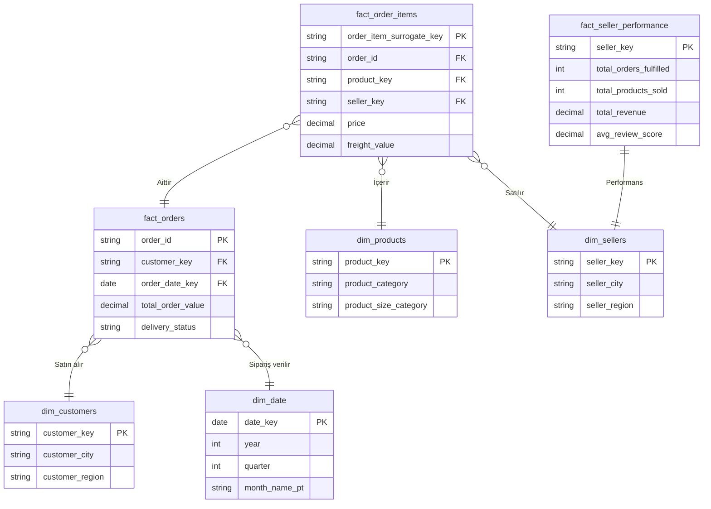

# 🚀 Olist Gelişmiş Büyük Veri Boru Hattı (Modern Data Stack)

Bu proje, Brezilya E-Ticaret Platformu Olist'e ait gerçek veri seti kullanılarak geliştirilmiş, uçtan uca, kurumsal seviyede bir **Büyük Veri (Big Data) ve Veri Mühendisliği** projesidir.

Modern Data Stack (Modern Veri Yığını) prensipleri benimsenerek; veriler Data Lake (Veri Gölü) ortamından alınmış, **Medallion Mimarisi** (Bronze, Silver, Gold) kullanılarak işlenmiş ve son kullanıcılar için Apache Superset üzerinde analiz edilebilir **Yıldız Şema (Star Schema)** modeline dönüştürülmüştür. Bütün bu akış Apache Airflow tarafından orkestre edilmektedir.

---

## 📸 Superset Analitik Dashboard

Projemizin çıktısı olan ve otomatik Python API scriptleri ile saniyeler içinde Superset üzerinde ayağa kalkan interaktif Olist Dashboard'undan görüntüler:


---

## 🏛️ Mimari Tasarım (Medallion Architecture)

Proje, veriyi ham halinden en değerli analitik haline kadar katman katman işleyen Medallion yaklaşımını kullanmaktadır:

```mermaid
graph LR
    subgraph "Extract & Load (EL)"
        CSV[("Kaggle Ham CSV")] -->|PySpark Ingestion| Bronze[("Bronze Katman\nIceberg / Parquet")]
    end
    
    subgraph "Transform (T) - dbt"
        Bronze -->|"dbt Staging (Deduplication)"| Silver[("Silver Katman\nTemizlenmiş Veri")]
        Silver -->|"dbt Models"| Gold[("Gold Katman\nYıldız Şema")]
    end
    
    subgraph "Serve & Analyze"
        Gold -->|"Apache Doris"| BI["Apache Superset\nDashboard API"]
    end
    
    Airflow(("Apache Airflow")) -.->|"Zamanlar"| PySpark Ingestion
    Airflow -.->|"Cosmos ile Çalıştırır"| Bronze
```

| Katman | Araç | Görev |
| :--- | :--- | :--- |
| 🥉 **Bronze (Ham)** | PySpark | Dış kaynaktaki veriyi hiçbir değişikliğe uğratmadan veri gölüne (Apache Iceberg) yazar. |
| 🥈 **Silver (Staging)** | dbt | Veri tiplerini düzeltir, **SELECT DISTINCT** mantığıyla mükerrer kayıtları temizler, NULL kayıtları süzer ve standartlaştırır. |
| 🥇 **Gold (Marts)** | dbt | Temizlenmiş verileri Star Schema yapısında birleştirerek iş birimine hazır Fact ve Dimension tabloları oluşturur. |

---

## 🌟 Veri Modelleme (Star Schema)

Analitik sorguların inanılmaz hızlı çalışması ve raporlama araçlarının (Superset vb.) rahat okuyabilmesi için **Gold** katmanımız Yıldız Şema yapısında tasarlanmıştır. Ciro hesaplamalarında **Ürün Fiyatı + Kargo (Freight)** hesaba katılarak tam kapsamlı Gross Merchandise Value (GMV) elde edilmiştir.



---

## 🛠️ Kullanılan Teknolojiler

*   **Veri Çıkarma (Ingestion):** PySpark (Büyük boyutlu verileri hızlıca Iceberg tablosu yapar)
*   **Veritabanı / Veri Ambarı:** Apache Doris (Aşırı hızlı, modern OLAP motoru)
*   **Veri Dönüştürme:** dbt (Data Build Tool - SQL ile test, dönüşüm, mükerrer veri engelleme)
*   **Orkestrasyon:** Apache Airflow & Astronomer Cosmos (Hata bildirimli gelişmiş DAG zincirleri)
*   **Veri Görselleştirme:** Apache Superset (Python API ile tam otomatik Dashboard Kurulumu)

---

## ✨ Projenin Kurumsal (Enterprise) Özellikleri

*   **Otomatik Dashboard Üretimi:** `visualization/create_dashboard.py` üzerinden Superset REST API kullanılarak tüm tablo kayıtları, veri setleri ve 10 farklı grafik otomatik oluşturulur.
*   **Deduplication (Veri Tekilleştirme):** Ingestion süreçlerinde yaşanabilecek tekrar yüklemeler (Data Duplication) dbt katmanında `DISTINCT` mekanizması ve `_ingested_at` kolon filtresiyle önlenir.
*   **Gelişmiş Metric'ler:** Treemap, Sunburst ve Coğrafi dağılım grafiklerinde Superset'in en modern ECharts bileşenleri (`treemap_v2`, `sunburst_v2` vb.) kullanıldı.
*   **dbt Macros & Seeds:** Tekrar eden SQL kodlarının modüler (DRY) yapılması ve Brezilya eyalet gibi referans verilerin statik CSV olarak sisteme alınması.
*   **SQL Linter:** Kod bütünlüğünü sağlamak için `SQLFluff` konfigürasyonu.

---

## 📂 Dosya ve Klasör Hiyerarşisi

Aşağıda projenin temiz ve modüler dosya ağacını görebilirsiniz:

```text
AdvancedBigDataPipeline/
├── Makefile                        # Tüm kurulum ve çalıştırma komutlarının bulunduğu merkezi araç
├── README.md                       # Proje dokümantasyonu (Bu dosya)
├── Dashboards/                     # Superset üzerinden alınan rapor ekran görüntüleri
├── airflow/                        # Airflow DAG'leri ve Astronomer konfigürasyonları
│   └── dags/
├── config/                         # Veritabanı, Spark ve diğer servis bağlantı ayarları
├── data/                           # Kaggle'dan indirilen Olist CSV dosyaları
├── docker/                         # Docker Compose YAML dosyaları (Doris, Superset, Airflow vb.)
├── olist_dbt/                      # dbt veri dönüşüm projesi
│   ├── dbt_project.yml
│   ├── macros/                     # SQL makroları (örn: get_brazil_region)
│   ├── models/
│   │   ├── staging/                # Silver katman (Veri temizleme ve tekilleştirme)
│   │   └── marts/                  # Gold katman (Fact ve Dimension tabloları)
│   ├── seeds/                      # Referans verileri (brazil_states.csv)
│   └── tests/                      # Veri doğrulama testleri
├── processing/                     # PySpark veri içe aktarma scriptleri (Bronze Ingestion)
├── scripts/                        # Otomasyon scriptleri (Veri indirme, ağ kurma vb.)
└── visualization/                  # Superset API otomasyon klasörü
    ├── cleanup.py                  # Eski dashboard'ları temizler
    ├── create_dashboard.py         # Grafikleri ve Dashboard'u sıfırdan kurar
    └── register_tables.py          # Veritabanı tablolarını Superset datasetlerine çevirir
```

---

## 🚀 Projeyi Çalıştırma (Kurulum)

### 1. Servisleri Başlatma
Tüm altyapı (Hadoop, Doris, Airflow, Superset) Docker üzerinde çalışır:
```bash
make setup
```

### 2. Veri Boru Hattını (Pipeline) Tetikleme
PySpark veriyi göle indirir ve dbt tüm dönüşüm/test süreçlerini çalıştırır:
```bash
make download
make pipeline
```

### 3. Superset (Dashboardlar)
Raporları ve panelleri oluşturmak için:
```bash
make dashboard
```
Erişim: `http://localhost:8088` (admin/admin).
