# 🚀 Olist Gelişmiş Büyük Veri Boru Hattı (Modern Data Stack)

Bu proje, Brezilya E-Ticaret Platformu Olist'e ait gerçek veri seti kullanılarak geliştirilmiş, uçtan uca, kurumsal seviyede bir **Büyük Veri (Big Data) ve Veri Mühendisliği** projesidir.

Modern Data Stack (Modern Veri Yığını) prensipleri benimsenerek; veriler Data Lake (Veri Gölü) ortamından alınmış, **Medallion Mimarisi** (Bronze, Silver, Gold) kullanılarak işlenmiş ve son kullanıcılar için Apache Superset üzerinde analiz edilebilir **Yıldız Şema (Star Schema)** modeline dönüştürülmüştür. Bütün bu akış Apache Airflow tarafından orkestre edilmektedir.

---

## 🏛️ Mimari Tasarım (Medallion Architecture)

Proje, veriyi ham halinden en değerli analitik haline kadar katman katman işleyen Medallion yaklaşımını kullanmaktadır:

```mermaid
graph LR
    subgraph "Extract & Load (EL)"
        CSV[(Kaggle Ham CSV)] -->|PySpark Ingestion| Bronze[(Bronze Katman\nIceberg / Parquet)]
    end
    
    subgraph "Transform (T) - dbt"
        Bronze -->|dbt Staging| Silver[(Silver Katman\nTemizlenmiş Veri)]
        Silver -->|dbt Models| Gold[(Gold Katman\nYıldız Şema)]
    end
    
    subgraph "Serve & Analyze"
        Gold -->|Apache Doris| BI[Apache Superset\nDashboard]
    end
    
    Airflow((Apache Airflow)) -.->|Zamanlar| PySpark Ingestion
    Airflow -.->|Cosmos ile Çalıştırır| Bronze
```

| Katman | Araç | Görev |
| :--- | :--- | :--- |
| 🥉 **Bronze (Ham)** | PySpark | Dış kaynaktaki veriyi hiçbir değişikliğe uğratmadan veri gölüne (Iceberg) yazar. |
| 🥈 **Silver (Staging)** | dbt | Veri tiplerini düzeltir, NULL kayıtları süzer ve veri kalitesini standartlaştırır. |
| 🥇 **Gold (Marts)** | dbt | Temizlenmiş verileri Star Schema (Yıldız Şema) yapısında birleştirerek iş birimine hazır Fact ve Dimension tabloları oluşturur. |

---

## 🌟 Veri Modelleme (Star Schema)

Analitik sorguların inanılmaz hızlı çalışması ve raporlama araçlarının (Superset vb.) rahat okuyabilmesi için **Gold** katmanımız Yıldız Şema yapısında tasarlanmıştır.

```mermaid
erDiagram
    fact_orders {
        string order_id PK
        string customer_key FK
        date order_date_key FK
        decimal total_order_value
        string delivery_status
    }
    
    fact_order_items {
        string order_item_surrogate_key PK
        string order_id FK
        string product_key FK
        string seller_key FK
        decimal price
        decimal freight_value
    }

    dim_customers {
        string customer_key PK
        string customer_city
        string customer_region
    }
    
    dim_sellers {
        string seller_key PK
        string seller_city
        string seller_region
    }

    dim_products {
        string product_key PK
        string product_category
        string product_size_category
    }

    dim_date {
        date date_key PK
        int year
        int quarter
        string month_name_pt
    }

    %% Relationships
    fact_orders }o--|| dim_customers : "Satın alır"
    fact_orders }o--|| dim_date : "Sipariş verilir"
    
    fact_order_items }o--|| fact_orders : "Aittir"
    fact_order_items }o--|| dim_products : "İçerir"
    fact_order_items }o--|| dim_sellers : "Satılır"
```



### 📊 Tablo Yapıları
1. **Fact (Gerçek) Tabloları:** `fact_orders`, `fact_order_items`, `fact_seller_performance` (Performans metrikleri ve sipariş tutarlarını içerir. Sadece yeni gelen verilerle **Incremental** olarak güncellenir).
2. **Dimension (Boyut) Tabloları:** `dim_customers`, `dim_products`, `dim_sellers`, `dim_date`, `dim_geography` (Sorguları filtrelemek ve gruplamak için kullanılan anahtar açıklayıcı özellikler. SCD2 geçmiş takibi içerir).

---

## 🛠️ Kullanılan Teknolojiler

*   **Veri Çıkarma (Ingestion):** PySpark (Büyük boyutlu verileri hızlıca Iceberg tablosu yapar)
*   **Veritabanı / Veri Ambarı:** Apache Doris (Aşırı hızlı, modern OLAP motoru)
*   **Veri Dönüştürme:** dbt (Data Build Tool - SQL ile test, dönüşüm, makro yazma)
*   **Orkestrasyon:** Apache Airflow & Astronomer Cosmos (Hata bildirimli gelişmiş DAG zincirleri)
*   **Veri Görselleştirme:** Apache Superset (Executive ve Operasyonel paneller)

---

## ✨ Projenin Kurumsal (Enterprise) Özellikleri

*   **Veri Kalite Testleri:** dbt Expectation ve Custom testler ile anomaly detection (Örn: Ödeme tutarı sipariş tutarını aşamaz).
*   **SCD Type 2 (Snapshots):** Müşteri lokasyon değişikliklerinin tarihsel bazda takip edilebilmesi.
*   **dbt Macros & Seeds:** Tekrar eden SQL kodlarının modüler (DRY) yapılması ve Brezilya eyalet gibi referans verilerin statik CSV olarak sisteme alınması.
*   **Gelişmiş Airflow SLA:** Belirlenen sürede (Service Level Agreement) tamamlanmayan veri akışlarında alarm bildirim sistemi.
*   **SQL Linter:** Kod bütünlüğünü sağlamak için `SQLFluff` konfigürasyonu.

---

## 🚀 Projeyi Çalıştırma (Kurulum)

### 1. Servisleri Başlatma
Tüm altyapı (Hadoop, Doris, Airflow, Superset) Docker üzerinde çalışır:
```bash
make setup
```

### 2. Veri Boru Hattını (Pipeline) Tetikleme
PySpark veriyi göle indirir ve dbt tüm dönüşüm/test süreçlerini çalıştırır:
```bash
make download
make pipeline
```

### 3. Veri Soyağacı (Lineage) ve Dokümantasyon
dbt'nin oluşturduğu otomatik web arayüzünü görmek için:
```bash
cd olist_dbt
dbt docs generate
dbt docs serve
```

### 4. Superset (Dashboardlar)
Raporları ve panelleri görüntülemek için `http://localhost:8088` adresine gidiniz (admin/admin).
